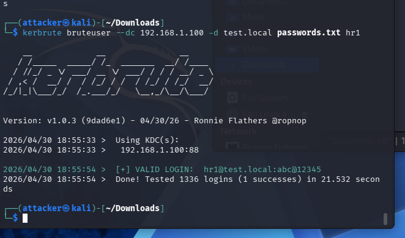

## Attack Simulation

A brute force attack was performed against the Active Directory user account `hr1`, targeting Kerberos authentication.

The attack generated multiple failed authentication attempts followed by a successful ticket request.



---

## Log Analysis in Splunk

Kerberos-related authentication events were analyzed using Windows Security Event Logs.

### Key Queries

```id="j7c2hf"
index=winsrvlogs sourcetype=WinEventLog:Security user=hr1
```

```id="p4z8lm"
index=winsrvlogs EventCode=4771 user=hr1
```

```id="s9x1kd"
index=winsrvlogs EventCode=4768 user=hr1
```

---

## Key Events Observed

* **4771** – Kerberos pre-authentication failed (multiple occurrences)
* **4768** – Kerberos authentication ticket (TGT) requested (successful)

---

## Observations

* Multiple **4771** events indicate repeated failed authentication attempts for user `hr1`
* A **4768** event occurred after these failures, indicating a successful authentication
* The sequence demonstrates a progression from failed attempts to eventual success
* Source system remained consistent across events

  

---

## Detection Insight

This behavior is suspicious because:

* Repeated Kerberos pre-authentication failures suggest password guessing or brute force attempts
* A successful TGT request following multiple failures indicates potential credential compromise

This pattern is commonly used in SOC environments to detect Kerberos-based brute force attacks.

---

## Validation

* Confirmed Kerberos-related logs were ingested into Splunk
* Verified sequence of failed (4771) and successful (4768) events
* Identified suspicious authentication pattern for user `hr1`
